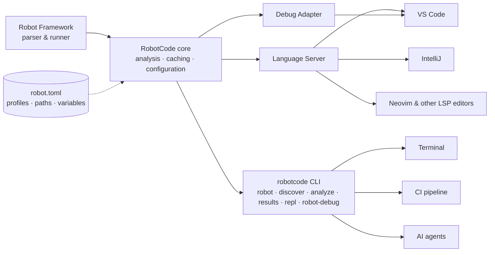

# RobotCode Treasures

Hands-on workshop — Robot Framework User Group Munich, September 2026.

Most people know [RobotCode](https://robotcode.io) as *the VS Code extension for Robot Framework*: syntax
highlighting, code completion, a ▶ button.  
That is only its most visible face.  
In this meetup, we dig out the treasures of RobotCode — and try every one of them on a small, realistic project.

## What is RobotCode?

RobotCode is a toolkit built around one core that uses Robot Framework's own parser. The same core powers the
editor, the command line, CI pipelines and AI agents, and all of them read the same `robot.toml`.



**Configure once, use everywhere:** what you set up in `robot.toml` is what the ▶ button, your terminal, the
pipeline and an AI agent all see.

## Get started

### In GitHub Codespaces (recommended)

On the repository page: **Code → Codespaces → Create codespace on main**. The Codespace comes with VS Code, the
RobotCode extension and [uv](https://docs.astral.sh/uv/) — but deliberately **without** a Python environment.
Creating it is the first exercise.

### Locally

You need Python 3.12+, [uv](https://docs.astral.sh/uv/getting-started/installation/) (or pip), VS Code with the
extensions *RobotCode*, *Python* and *Even Better TOML*, and a clone of this repository with all branches.

## Agenda

| # | Chapter | Switch with |
|---|---|---|
| 0 | Intro: what is RobotCode? | *(this page)* |
| 1 | Getting started: environments with uv and pip | `./topic 01` |
| 2 | `robot.toml`, profiles and `.robotignore` | `./topic 02` |
| 3 | `discover`: what tests do I actually have? | `./topic 03` |
| 4 | REPL and notebooks | `./topic 04` |
| | *Break* | |
| 5 | Running tests and the wrapper | `./topic 05` |
| 6 | `robot-debug`: debugging without a GUI | `./topic 06` |
| 7 | Analyzer, diagnostics modifiers, Robocop, CI | `./topic 07` |
| 8 | `results`: what happened, without opening `log.html` | `./topic 08` |
| 9 | Working with AI agents | `./topic 09` |
| | Wrap-up: [cheat sheet](CHEATSHEET.md) | `./topic main` |

## Moving between chapters

Every chapter lives on its own branch and starts from this clean project, so you can join at any chapter.
Use the `./topic` script in the terminal:

```bash
./topic                 # list all chapters
./topic 05              # go to chapter 5 and open its TOPIC.md
./topic 05 --solution   # look at the model solution
./topic check           # compare your work with the solution
./topic reset           # start the current chapter over
./topic main            # back to this page
```

Your changes are never lost: when you leave a chapter, `./topic` saves them, and when you come back they are
restored. Each chapter's `TOPIC.md` follows the same structure — 😖 pain, 💎 treasure, 🖥️ demo,
🛠️ exercise, 💡 hints, ✅ self-check and 🔑 takeaway.

## The demo project: a tiny bank

Accounts, deposits, withdrawals and transfers. Checking accounts may be overdrawn up to their limit, savings
accounts may not. The domain is deliberately trivial, so all attention stays on RobotCode.

```text
bank/BankLibrary.py        Robot Framework keywords (in-memory bank, or the web service if ${BANK_URL} is set)
bank/service.py            the same bank as a JSON web service:  python -m bank.service
resources/banking.resource project keywords
tests/accounts/            smoke and regression tests
tests/api/                 integration tests against the web service
robot.toml                 profiles: local, service, smoke, regression, ci
```

## Links

- Documentation: <https://robotcode.io>
- What's new: <https://robotcode.io/news/>
- Source and issues: <https://github.com/robotcodedev/robotcode>
- Agent plugins: <https://github.com/robotcodedev/robotframework-agent-plugins>
